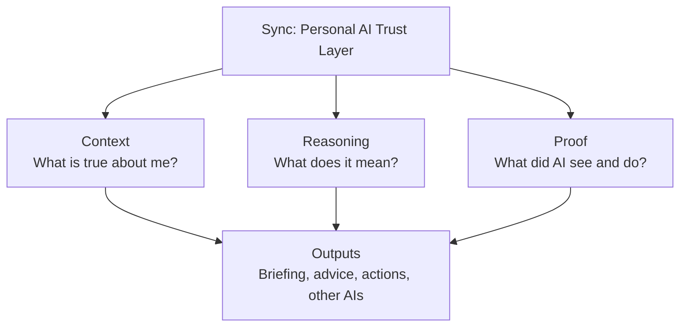

# Sync Product Identity

**This is the current product definition.**

When older docs, roadmaps, comments, or code comments describe Sync as a daily briefing, planner-adjacent life app, or “personal reasoning engine for Today,” this file wins.

Read this first. Then read `SYNC_ENGINE_MANIFESTO.md`, `SYNC_REASONING_SPEC.md`, and `SYNC_ENGINE_ROADMAP.md` for constitution, pipeline, and sequencing. Those remain in force **except** where they treat a briefing surface, Life Graph, or the existing app as the product.

---

## What Sync is becoming

> **Sync is a personal AI context and trust layer.** It builds an accurate, user-controlled understanding of your life, helps AI make better decisions, and keeps a verifiable record of what AI systems saw, decided, and did.

The product is **trusted personal context**, not a screen.

Sync should answer three questions, in this order:

1. **Context** — What is true about me?
2. **Reasoning** — What does that information mean, and what matters?
3. **Proof** — What did AI see, decide, and do?

Outputs (briefings, advice, actions, other AIs) consume those three. They are not the destination.

---

## Supporting systems (not the product)

These already exist or are started in the repo. Keep them. Do not promote them into the product identity.

| System | Role |
|---|---|
| **Life Graph** | Internal infrastructure that organizes personal context. Not the destination. |
| **Reasoning engine** | Determines what information means and what matters (Understanding → Memory Decision → Consequences → Judgment → Response). |
| **Activity Passport** | Proof layer: what an AI read, suggested, or acted on — with provenance, verification, and no invented confidence. |
| **Briefing / Today / Home** | One interface showing the value of that intelligence. A proving-ground output, not the product. |
| **Capture, Memory, My Life, Timeline** | Ways to feed, inspect, and correct context. User control lives here. |
| **Integrations** | Eventually let trusted context work across other AIs. Optional, consent-based, deferred until context + reasoning + proof are unified enough to trust. |

The reasoning pipeline in `SYNC_REASONING_SPEC.md` is unchanged. Do not fork it. Do not add a parallel brain for “trust layer” vs “briefing app.”

---

## What Sync is not

Unchanged, and still binding:

- a task manager, planner, or notes app
- a productivity dashboard or widget collection
- a chatbot-first product
- a calendar, finance, or health **app**
- a habit tracker, coach, or scorekeeper
- an enterprise CISO / agent-security control plane

A briefing app that merely ranks today’s items is **not** the product Sync is becoming, even if most of the current code still looks like that.

---

## Honest current position

**Sync has parts of the context and reasoning foundation, plus the beginning of the proof layer — but those pieces have not yet been unified into this product vision.**

That means:

- Capture, memory, meaning, consequences, and judgment **exist** and should be reused.
- Life Graph **exists** as context infrastructure; it is not finished as a user-controlled source of truth.
- Activity + Passport **exist as contracts and tests**, not as a live proof record on real actions.
- Today / Brief / lab **display** engine output. Improving them is allowed only when it proves context, reasoning, or proof — not to make a better briefing product.

Do not describe the current codebase as if this identity is already shipped.

---

## Gate for every change

Ask, in this order:

1. **Does this strengthen Sync as a personal AI context and trust layer?**
2. Does it improve **Context**, **Reasoning**, or **Proof** — or the user’s ability to inspect, correct, and delete them?
3. Does it improve the engine’s ability to make **trustworthy decisions** (see `SYNC_EVALUATION.md`)?

If the work only makes Today, Home, or Daily Brief nicer, stop unless it is required to prove one of the three layers.

Default prompt prefix:

> **Improve Sync as a personal AI context and trust layer by…**

Then name the layer (Context, Reasoning, or Proof), a messy real-life example, and the test that proves it.

---

## How agents should use older docs

| Document | Use for | Subordinate when |
|---|---|---|
| **This file (`SYNC_PRODUCT.md`)** | Product identity, hierarchy, current position | — |
| `SYNC_ENGINE_MANIFESTO.md` | Constitution, trust rules | It frames “the product” as a briefing or Today |
| `SYNC_REASONING_SPEC.md` | Required pipeline per input | Never fork; identity does not replace the pipeline |
| `SYNC_ENGINE_ROADMAP.md` | Sequencing (lab, TDR, alpha) | It treats UI surfaces as the thing being built |
| `SYNC_VISION.md` / `SYNC_VOICE.md` | Voice, surface design | Surfaces are described as the product |
| `ROADMAP.md` | Historical module status | Sequencing or identity |
| Code and comments | What is implemented today | They describe what Sync *is becoming* |

---

## Unification target (not a UI project)

The next real product work is to **unify** existing pieces under this identity:

1. **Context** — user-controlled, accurate, inspectable life understanding (Life Graph + memory, not a new graph product).
2. **Reasoning** — one pipeline that uses that context to decide meaning and priority.
3. **Proof** — Activity/Passport attached to what Sync (and later other AIs) saw, decided, and did.
4. **Outputs** — briefing, advice, and later other AIs as consumers.

Until that unification exists, prefer contracts, tests, and shared intelligence over new surfaces.
